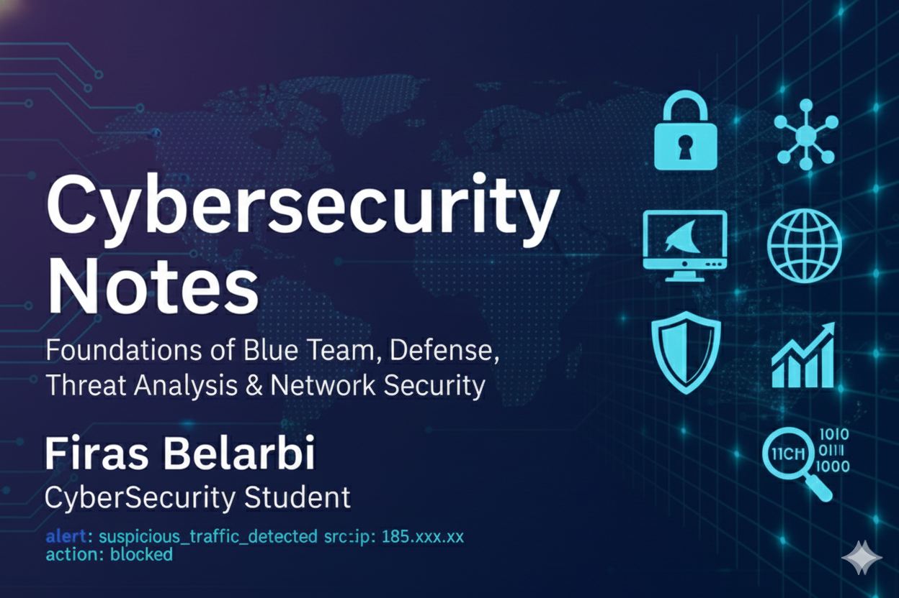

  

<h1 align="center">Cybersecurity Notes — Summary</h1>

  Foundations of Blue Team, Defense, Threat Analysis, and Network Security. 
  Clean and organized notes from my cybersecurity learning journey.

---

## 1. Introduction
Cybersecurity is a core part of modern technology.  
Professionals in this field work with:

- Security Operations Centers (SOC)
- Blue Team defensive operations
- Threat hunting and malware analysis
- Penetration testing and red team operations
- Network and system security engineering
- Incident response and digital forensics

These notes summarize what I have learned from:

- TryHackMe rooms  
- Blue/Red Team labs  
- SOC and SIEM simulations  
- Networking, Linux, and Windows security practice  
- University courses  

---

## 2. Core Cybersecurity Concepts

### CIA Triad
- Confidentiality  
- Integrity  
- Availability  

### Zero Trust Model
Every request must be authenticated and authorized.  
No user or device is trusted by default.

### Attack Surface
All possible paths an attacker can use to enter a system.

---

## 3. Threat Landscape

### Common Attack Types
- Phishing  
- Malware  
- Ransomware  
- SQL Injection  
- Brute-force attacks  
- Privilege escalation  
- Man-in-the-Middle (MITM)  
- Social Engineering  

### Indicators of Compromise (IoCs)
- Suspicious IP addresses  
- Abnormal login behavior  
- Unusual network traffic  
- Unknown processes or binaries  

---

## 4. Blue Team and Defensive Operations

### Defensive Tasks
- Monitoring system activity  
- Analyzing logs  
- Detecting threats  
- Blocking malicious traffic  
- Investigating incidents  
- Writing documentation and reports  

### Monitoring Tools
- SIEM platforms (Splunk, ELK, Wazuh)  
- Sysmon  
- Wireshark  
- Zeek  

---

## 5. SOC Fundamentals (Security Operations Center)

### SOC Tiers
- Tier 1: Alert analysis  
- Tier 2: Deep investigation  
- Tier 3: Threat hunting  
- Tier 4: Security engineering and automation  

### Example SIEM Alert

alert: suspicious_traffic_detected
src_ip: 185.xxx.xx
action: blocked

---

## 6. Network Security

### Key Topics
- TCP/IP  
- Ports and protocols  
- Firewalls  
- IDS and IPS  
- VPN  
- Packet analysis  

### Tools
- Nmap  
- Wireshark  
- tcpdump  
- Zeek  

---

## 7. Linux Security
Essential topics:

- File permissions  
- Users and groups  
- SSH hardening  
- Syslog monitoring  
- Fail2ban  
- Detecting suspicious sudo activity  

---

## 8. Windows Security
Important concepts:

- Event Viewer  
- Active Directory basics  
- PowerShell monitoring  
- Logon types  
- Sysmon rules  
- Registry analysis  

---

## 9. Digital Forensics and Incident Response

### DFIR Topics
- Memory forensics  
- Disk forensics  
- Timeline analysis  
- Malware behavior analysis  

### Tools
- Volatility  
- Autopsy  
- FTK Imager  
- CyberChef  

---

## 10. Essential Cybersecurity Tools
- Nmap  
- Wireshark  
- Sysmon  
- Splunk  
- Wazuh  
- Volatility  
- OSQuery  

---

## 11. TryHackMe Rooms Used
- Blue  
- Wazuh  
- Investigation-based rooms  
- Network Security  
- SOC Level 1  
- Linux Fundamentals  
- Intro to Digital Forensics  

---

## 12. Purpose of This Repository
This repository consolidates my cybersecurity knowledge across:

- SOC operations  
- Blue Team techniques  
- Networking fundamentals  
- Linux and Windows security  
- Threat hunting  
- Digital forensics  
- Practical labs and exercises  

The goal is to create a reference that reflects my progress and supports my future career in cybersecurity.

---

  Maintained by Firas Belarbi — Cybersecurity Student

